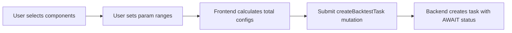
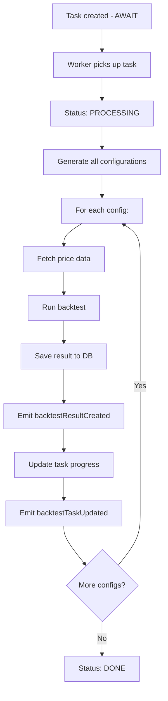
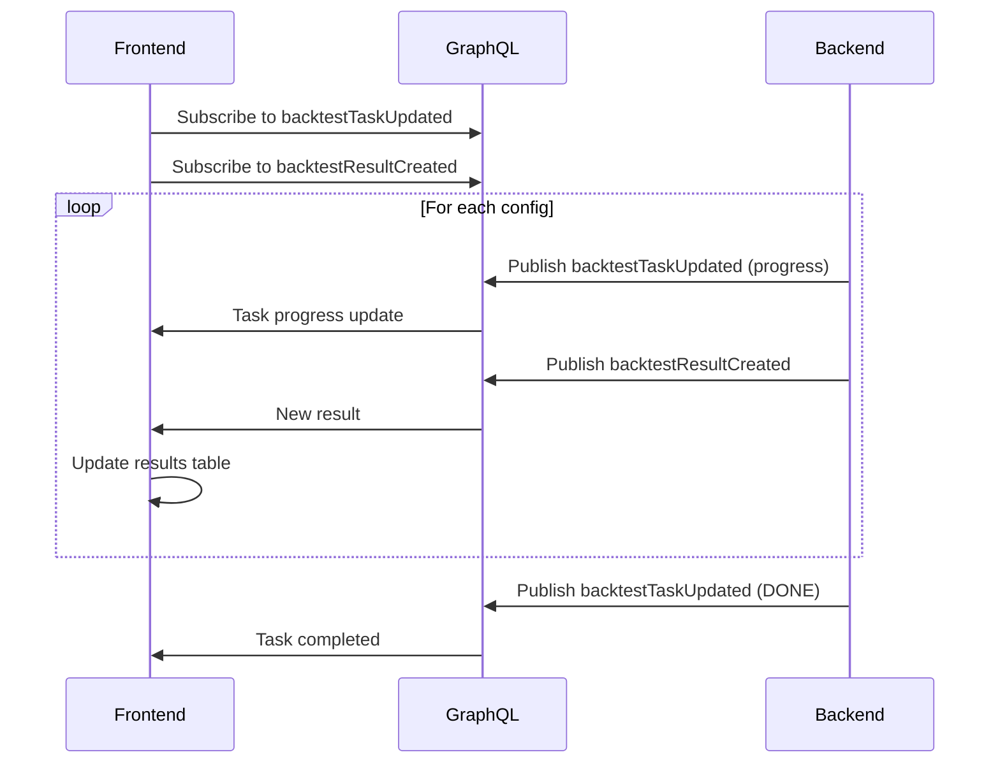

# Backtest System - Frontend Integration Guide

This document provides comprehensive context for building the frontend for the backtest optimization system.

---

## Table of Contents

1. [Overview](#overview)
2. [GraphQL Schema](#graphql-schema)
3. [Data Types](#data-types)
4. [Component Metadata](#component-metadata)
5. [Optimization Flow](#optimization-flow)
6. [Real-time Updates](#real-time-updates)
7. [File Structure](#file-structure)
8. [Example Usage](#example-usage)

---

## Overview

The backtest system allows users to:

1. **Create optimization tasks** - Define parameter ranges to test multiple strategy configurations
2. **Monitor progress** - Real-time updates via GraphQL subscriptions
3. **View results** - Sorted/filtered results with performance metrics
4. **Access files** - CSV trade details, charts, and config files

### Key Concepts

- **Task**: A backtest optimization job with multiple configurations to test
- **Configuration**: A single strategy parameter combination to backtest
- **Result**: Performance metrics from running one configuration
- **Component**: Building blocks of a strategy (signal, filter, risk, exit)

---

## GraphQL Schema

### Enums

```graphql
enum BacktestTaskStatus {
  AWAIT # Task created, waiting to be processed
  PROCESSING # Currently running backtests
  DONE # All configurations completed
  FAILED # Task failed with error
  CANCELLED # User cancelled the task
}
```

### Queries

```graphql
# Get available strategy components with their parameters
query BacktestComponents {
  backtestComponents {
    signals { name, description, params { name, type, required, default, description, min, max } }
    filters { name, description, params { ... } }
    risk { name, description, params { ... } }
    exits { name, description, params { ... } }
  }
}

# Get a single task by ID
query BacktestTask($id: ID!) {
  backtestTask(id: $id) {
    id, name, symbol, status, progress
    totalConfigs, processedConfigs, currentConfig
    startDate, endDate, interval
    optimizationParams
    createdAt, startedAt, completedAt
    errorMessage
  }
}

# List tasks with filtering
query BacktestTasks(
  $status: BacktestTaskStatus
  $symbol: String
  $limit: Int = 20
  $offset: Int = 0
) {
  backtestTasks(status: $status, symbol: $symbol, limit: $limit, offset: $offset) {
    id, name, symbol, status, progress
    totalConfigs, processedConfigs
    createdAt, startedAt, completedAt
  }
}

# Get task statistics by status
query BacktestTaskStats {
  backtestTaskStats {
    await       # Count of AWAIT tasks
    processing  # Count of PROCESSING tasks
    done        # Count of DONE tasks
    failed      # Count of FAILED tasks
  }
}

# Get results for a task (with sorting and pagination)
query BacktestResults(
  $taskId: ID!
  $sortBy: String = "totalPnlUsdt"   # Options: totalPnlUsdt, winRate, sharpeRatio, profitFactor, maxDrawdownPercent
  $sortOrder: String = "desc"        # asc | desc
  $limit: Int = 50
  $offset: Int = 0
) {
  backtestResults(taskId: $taskId, sortBy: $sortBy, sortOrder: $sortOrder, limit: $limit, offset: $offset) {
    id, taskId, configId, runDate
    strategyConfig
    totalTrades, winningTrades, losingTrades, winRate
    totalPnlUsdt, totalPnlPercent
    maxDrawdownUsdt, maxDrawdownPercent
    sharpeRatio, profitFactor
    resultFolder, createdAt
  }
}

# Get top N results by a metric
query TopBacktestResults($taskId: ID!, $metric: String = "totalPnlUsdt", $limit: Int = 10) {
  topBacktestResults(taskId: $taskId, metric: $metric, limit: $limit) {
    id, configId, totalPnlUsdt, winRate, sharpeRatio, profitFactor, strategyConfig
  }
}

# File navigation queries
query BacktestResultDates($taskId: ID!) {
  backtestResultDates(taskId: $taskId)  # Returns: ["2024-01-15", "2024-01-14", ...]
}

query BacktestResultFolders($taskId: ID!, $date: String!) {
  backtestResultFolders(taskId: $taskId, date: $date) {
    taskId, date, configId
    files  # ["config.json", "trade-details.csv", "trade-summary.csv", "pnl-chart.png"]
  }
}

query BacktestResultFile($taskId: ID!, $date: String!, $configId: String!, $fileName: String!) {
  backtestResultFile(taskId: $taskId, date: $date, configId: $configId, fileName: $fileName) {
    name
    content        # Base64 gzip compressed if isCompressed=true, otherwise raw text or base64 (for images)
    contentType    # "application/json", "text/csv", "image/png"
    size           # Size of content field (compressed + base64 encoded if applicable)
    originalSize   # Original file size in bytes
    isCompressed   # true if content is gzip compressed + base64 encoded
  }
}
```

### Mutations

```graphql
# Create a new optimization task
mutation CreateBacktestTask($input: CreateBacktestTaskInput!) {
  createBacktestTask(input: $input) {
    id
    name
    status
    totalConfigs
  }
}

# Cancel a running/pending task
mutation CancelBacktestTask($taskId: ID!) {
  cancelBacktestTask(taskId: $taskId) {
    id
    status
  }
}

# Delete a task and all its results
mutation DeleteBacktestTask($taskId: ID!) {
  deleteBacktestTask(taskId: $taskId) # Returns: Boolean
}

# Delete a single result
mutation DeleteBacktestResult($resultId: ID!) {
  deleteBacktestResult(resultId: $resultId) # Returns: Boolean
}

# Retry a failed task
mutation RetryBacktestTask($taskId: ID!) {
  retryBacktestTask(taskId: $taskId) {
    id
    status
  }
}
```

### Subscriptions

```graphql
# Subscribe to task progress updates
subscription BacktestTaskUpdated($taskId: ID!) {
  backtestTaskUpdated(taskId: $taskId) {
    id
    status
    progress
    processedConfigs
    totalConfigs
    currentConfig
    completedAt
    errorMessage
  }
}

# Subscribe to new results as they complete
subscription BacktestResultCreated($taskId: ID!) {
  backtestResultCreated(taskId: $taskId) {
    id
    taskId
    configId
    totalTrades
    winRate
    totalPnlUsdt
    sharpeRatio
    profitFactor
    strategyConfig
  }
}
```

---

## Data Types

### CreateBacktestTaskInput

```typescript
interface CreateBacktestTaskInput {
  name: string; // User-friendly task name
  symbol: string; // Trading pair, e.g., "BTCUSDT"
  startDate: Date; // Backtest start date
  endDate: Date; // Backtest end date
  interval?: string; // Candle interval, default "1m"
  optimizationParams: OptimizationParams;
}
```

### OptimizationParams

The optimization params define **arrays of values** for each parameter. The backend generates the cartesian product of all combinations.

```typescript
interface OptimizationParams {
  signal: OptimizationComponentConfig;
  filters?: OptimizationComponentConfig[];
  risk: OptimizationComponentConfig;
  exits: OptimizationComponentConfig[];
  settings?: {
    capitalBase?: number[];
  };
}

interface OptimizationComponentConfig {
  type: string; // Component type key, e.g., "emaCrossover"
  params: Record<string, (number | boolean | string)[]>; // Arrays of values to test
}
```

**Example:**

```json
{
  "signal": {
    "type": "emaCrossover",
    "params": {
      "fastPeriod": [10, 20, 30],
      "slowPeriod": [50, 100, 200]
    }
  },
  "filters": [
    {
      "type": "adxTrend",
      "params": {
        "period": [14],
        "threshold": [20, 25, 30]
      }
    }
  ],
  "risk": {
    "type": "atrBased",
    "params": {
      "riskPercent": [1, 2],
      "stopMultiplier": [2, 2.5, 3]
    }
  },
  "exits": [
    {
      "type": "trailingStop",
      "params": {
        "atrMultiplier": [1.5, 2, 2.5]
      }
    }
  ]
}
```

This example generates: `3 * 3 * 1 * 3 * 2 * 3 * 3 = 486` configurations.

### BacktestTask

```typescript
interface BacktestTask {
  id: string;
  name: string;
  symbol: string;
  optimizationParams: OptimizationParams;
  startDate: Date;
  endDate: Date;
  interval: string;
  status: BacktestTaskStatus;
  totalConfigs: number; // Total configurations to test
  processedConfigs: number; // Completed configurations
  currentConfig?: string; // UUID of currently processing config
  progress: number; // Computed: (processedConfigs / totalConfigs) * 100
  createdAt: Date;
  startedAt?: Date;
  completedAt?: Date;
  errorMessage?: string;
}
```

### BacktestResult

```typescript
interface BacktestResult {
  id: string;
  taskId: string;
  configId: string; // UUID for this specific configuration
  runDate: string; // "yyyy-mm-dd" format
  strategyConfig: StrategyConfig; // The full configuration used

  // Performance metrics
  totalTrades: number;
  winningTrades: number;
  losingTrades: number;
  winRate: number; // Percentage (0-100)
  totalPnlUsdt: number; // Total profit/loss in USDT
  totalPnlPercent: number; // Total P&L as percentage
  maxDrawdownUsdt: number;
  maxDrawdownPercent: number;
  sharpeRatio?: number;
  profitFactor?: number; // Gross profits / Gross losses

  resultFolder: string; // Path: result/{date}/{taskId}/{configId}
  createdAt: Date;
}
```

### StrategyConfig (in result)

```typescript
interface StrategyConfig {
  symbol: string;
  name: string;
  description?: string;
  signal: ComponentConfig;
  filters: ComponentConfig[];
  risk: ComponentConfig;
  exits: ComponentConfig[];
  settings?: {
    timeframe?: string;
    maxOpenPositions?: number;
    cooldownCandles?: number;
    capitalBase?: number;
  };
}

interface ComponentConfig {
  type: string;
  params: Record<string, any>;
}
```

---

## Component Metadata

Use `backtestComponents` query to get available components and their parameter definitions.

### Available Components

#### Signals

| Type           | Name          | Description                                              |
| -------------- | ------------- | -------------------------------------------------------- |
| `emaCrossover` | EMA Crossover | Generates signals on EMA crossovers (golden/death cross) |

**emaCrossover params:**
| Param | Type | Required | Default | Min | Max | Description |
|-------|------|----------|---------|-----|-----|-------------|
| `fastPeriod` | number | Yes | 20 | 5 | 100 | Fast EMA period |
| `slowPeriod` | number | Yes | 50 | 20 | 500 | Slow EMA period |

#### Filters

| Type       | Name             | Description                                 |
| ---------- | ---------------- | ------------------------------------------- |
| `adxTrend` | ADX Trend Filter | Filters signals based on ADX trend strength |

**adxTrend params:**
| Param | Type | Required | Default | Min | Max | Description |
|-------|------|----------|---------|-----|-----|-------------|
| `period` | number | Yes | 14 | 7 | 50 | ADX calculation period |
| `threshold` | number | Yes | 25 | 10 | 50 | Minimum ADX value to allow signal |
| `timeframe` | number | No | 60 | 1 | 1440 | Timeframe in minutes for ADX calculation |
| `inverse` | boolean | No | false | - | - | Inverse filter for mean reversion strategies |

#### Risk (Position Sizing)

| Type       | Name                    | Description                                      |
| ---------- | ----------------------- | ------------------------------------------------ |
| `fixed`    | Fixed Position Size     | Uses fixed USDT position size per trade          |
| `atrBased` | ATR-Based Position Size | Calculates position size based on ATR volatility |

**fixed params:**
| Param | Type | Required | Default | Min | Max | Description |
|-------|------|----------|---------|-----|-----|-------------|
| `positionSizeUsdt` | number | Yes | 1000 | 100 | - | Fixed position size in USDT |
| `stopPercent` | number | No | 2 | 0.5 | 10 | Stop loss percentage for position sizing |

**atrBased params:**
| Param | Type | Required | Default | Min | Max | Description |
|-------|------|----------|---------|-----|-----|-------------|
| `riskPercent` | number | Yes | 2 | 0.5 | 10 | Risk per trade as % of capital |
| `atrPeriod` | number | No | 14 | 7 | 50 | ATR calculation period |
| `stopMultiplier` | number | Yes | 2.5 | 1 | 5 | ATR multiplier for stop distance |
| `capitalBase` | number | No | 10000 | - | - | Fixed capital base for position sizing |
| `useEquity` | boolean | No | false | - | - | Use current equity instead of fixed capital |
| `maxPositionPercent` | number | No | 20 | 5 | 100 | Max position size as % of capital |

#### Exits

| Type           | Name               | Description                                                |
| -------------- | ------------------ | ---------------------------------------------------------- |
| `crossover`    | EMA Crossover Exit | Exits on opposite EMA crossover signal                     |
| `trailingStop` | Trailing Stop      | ATR-based trailing stop with optional activation threshold |
| `takeProfit`   | Take Profit        | Fixed percentage or R-multiple take profit                 |

**crossover params:**
| Param | Type | Required | Default | Min | Max | Description |
|-------|------|----------|---------|-----|-----|-------------|
| `fastPeriod` | number | No | 20 | 5 | 100 | Fast EMA period for exit detection |
| `slowPeriod` | number | No | 50 | 20 | 500 | Slow EMA period for exit detection |

**trailingStop params:**
| Param | Type | Required | Default | Min | Max | Description |
|-------|------|----------|---------|-----|-----|-------------|
| `atrMultiplier` | number | Yes | 2 | 1 | 5 | ATR multiplier for stop distance |
| `atrPeriod` | number | No | 14 | 7 | 50 | ATR calculation period |
| `activateAfterPercent` | number | No | 0 | 0 | 10 | Profit % required to activate trailing |

**takeProfit params:**
| Param | Type | Required | Default | Min | Max | Description |
|-------|------|----------|---------|-----|-----|-------------|
| `percent` | number | No | - | 0.5 | 50 | Take profit as % of entry |
| `rMultiple` | number | No | - | 1 | 10 | Take profit as multiple of risk (R) |

---

## Optimization Flow

### 1. User Creates Task



### 2. Backend Processing



### 3. Real-time Frontend Updates



---

## Real-time Updates

### Subscription Setup Example (React + Apollo)

```typescript
import { useSubscription } from "@apollo/client";

// Subscribe to task progress
const { data: taskUpdate } = useSubscription(BACKTEST_TASK_UPDATED, {
  variables: { taskId },
  skip: !taskId || task?.status === "DONE",
});

// Subscribe to new results
const { data: newResult } = useSubscription(BACKTEST_RESULT_CREATED, {
  variables: { taskId },
  skip: !taskId || task?.status === "DONE",
  onData: ({ data }) => {
    // Append new result to results list
    setResults((prev) => [data.backtestResultCreated, ...prev]);
  },
});
```

### Update Frequency

- **Task progress**: Updated after each configuration completes
- **New results**: Emitted immediately when a configuration completes
- **Progress percentage**: `(processedConfigs / totalConfigs) * 100`

---

## File Structure

Each backtest result generates files in this structure:

```
result/
└── {yyyy-mm-dd}/
    └── {taskId}/
        └── {configId}/
            ├── config.json         # Strategy configuration used
            ├── trade-details.csv   # Individual trade records
            ├── trade-summary.csv   # Summary statistics
            └── pnl-chart.png       # Cumulative P&L chart
```

### File Contents

**config.json:**

```json
{
  "symbol": "BTCUSDT",
  "name": "EMA Strategy #1 - EMA(20/50)",
  "signal": {
    "type": "emaCrossover",
    "params": { "fastPeriod": 20, "slowPeriod": 50 }
  },
  "filters": [],
  "risk": {
    "type": "atrBased",
    "params": { "riskPercent": 2, "stopMultiplier": 2.5 }
  },
  "exits": [{ "type": "trailingStop", "params": { "atrMultiplier": 2 } }],
  "settings": { "capitalBase": 10000 }
}
```

**trade-details.csv:**

```csv
Trade #,Side,Entry Time,Entry Price,Exit Time,Exit Price,Position Size (USDT),PnL (USDT),PnL (%),Cumulative PnL (USDT)
1,LONG,2023-01-15T10:00:00.000Z,20500.00,2023-01-15T14:30:00.000Z,21000.00,1000.00,24.39,2.44,24.39
2,SHORT,2023-01-16T08:00:00.000Z,21200.00,2023-01-16T12:00:00.000Z,20800.00,1000.00,18.87,1.89,43.26
```

**trade-summary.csv:**

```csv
Metric,Value
Symbol,BTCUSDT
Start Date,2023-01-01T00:00:00.000Z
End Date,2023-12-31T23:59:59.999Z
Total Trades,150
Winning Trades,82
Losing Trades,68
Win Rate (%),54.67
Total PnL (USDT),2450.50
Total PnL (%),24.51
Max Drawdown (USDT),450.00
Max Drawdown (%),4.50
Avg Position Size (USDT),1000.00
Sharpe Ratio,1.25
Profit Factor,1.85
```

**pnl-chart.png:** Line chart showing cumulative P&L over trades.

---

## Example Usage

### Create Optimization Task

```typescript
const CREATE_BACKTEST_TASK = gql`
  mutation CreateBacktestTask($input: CreateBacktestTaskInput!) {
    createBacktestTask(input: $input) {
      id
      name
      status
      totalConfigs
    }
  }
`;

// Calculate total configs before submission
const calculateTotalConfigs = (params: OptimizationParams): number => {
  let total = 1;

  // Signal combinations
  Object.values(params.signal.params).forEach((arr) => {
    if (Array.isArray(arr)) total *= arr.length;
  });

  // Filter combinations
  params.filters?.forEach((filter) => {
    Object.values(filter.params).forEach((arr) => {
      if (Array.isArray(arr)) total *= arr.length;
    });
  });

  // Risk combinations
  Object.values(params.risk.params).forEach((arr) => {
    if (Array.isArray(arr)) total *= arr.length;
  });

  // Exit combinations
  params.exits.forEach((exit) => {
    Object.values(exit.params).forEach((arr) => {
      if (Array.isArray(arr)) total *= arr.length;
    });
  });

  // Capital base combinations
  if (params.settings?.capitalBase?.length) {
    total *= params.settings.capitalBase.length;
  }

  return total;
};

// Submit task
const { data } = await createBacktestTask({
  variables: {
    input: {
      name: "EMA Optimization - BTC",
      symbol: "BTCUSDT",
      startDate: new Date("2023-01-01"),
      endDate: new Date("2024-01-01"),
      interval: "1m",
      optimizationParams: {
        signal: {
          type: "emaCrossover",
          params: {
            fastPeriod: [10, 20, 30],
            slowPeriod: [50, 100, 200],
          },
        },
        filters: [],
        risk: {
          type: "atrBased",
          params: {
            riskPercent: [1, 2],
            stopMultiplier: [2, 2.5, 3],
          },
        },
        exits: [
          {
            type: "trailingStop",
            params: {
              atrMultiplier: [1.5, 2, 2.5],
            },
          },
        ],
      },
    },
  },
});
```

### Monitor Progress

```typescript
const BACKTEST_TASK_UPDATED = gql`
  subscription BacktestTaskUpdated($taskId: ID!) {
    backtestTaskUpdated(taskId: $taskId) {
      id
      status
      processedConfigs
      totalConfigs
      progress
      currentConfig
      completedAt
      errorMessage
    }
  }
`;

// In component
const { data, loading } = useSubscription(BACKTEST_TASK_UPDATED, {
  variables: { taskId },
});

// Render progress bar
<ProgressBar value={data?.backtestTaskUpdated?.progress || 0} />
<span>{data?.backtestTaskUpdated?.processedConfigs} / {data?.backtestTaskUpdated?.totalConfigs}</span>
```

### Display Results Table

```typescript
const BACKTEST_RESULTS = gql`
  query BacktestResults(
    $taskId: ID!
    $sortBy: String
    $sortOrder: String
    $limit: Int
    $offset: Int
  ) {
    backtestResults(
      taskId: $taskId
      sortBy: $sortBy
      sortOrder: $sortOrder
      limit: $limit
      offset: $offset
    ) {
      id
      configId
      totalTrades
      winRate
      totalPnlUsdt
      totalPnlPercent
      maxDrawdownPercent
      sharpeRatio
      profitFactor
      strategyConfig
    }
  }
`;

// Sortable columns
const sortableColumns = [
  { key: "totalPnlUsdt", label: "Total P&L" },
  { key: "winRate", label: "Win Rate" },
  { key: "sharpeRatio", label: "Sharpe Ratio" },
  { key: "profitFactor", label: "Profit Factor" },
  { key: "maxDrawdownPercent", label: "Max Drawdown" },
];
```

### View Result Files

```typescript
const BACKTEST_RESULT_FILE = gql`
  query BacktestResultFile($taskId: ID!, $date: String!, $configId: String!, $fileName: String!) {
    backtestResultFile(taskId: $taskId, date: $date, configId: $configId, fileName: $fileName) {
      name
      content
      contentType
      size
      originalSize
      isCompressed
    }
  }
`;

// Helper function to decompress gzipped content
import pako from 'pako'; // npm install pako

function decompressContent(content: string, isCompressed: boolean): string {
  if (!isCompressed) {
    return content;
  }
  // Content is base64 encoded gzip - decode then decompress
  const binaryString = atob(content);
  const bytes = new Uint8Array(binaryString.length);
  for (let i = 0; i < binaryString.length; i++) {
    bytes[i] = binaryString.charCodeAt(i);
  }
  const decompressed = pako.ungzip(bytes, { to: 'string' });
  return decompressed;
}

// Display chart image (images are NOT compressed, just base64)
const { data } = useQuery(BACKTEST_RESULT_FILE, {
  variables: {
    taskId,
    date: result.runDate,
    configId: result.configId,
    fileName: 'pnl-chart.png'
  }
});

// For PNG, content is base64 encoded (not compressed)


// For CSV/JSON, content may be compressed (files > 10KB are compressed)
const fileData = data?.backtestResultFile;
const csvContent = fileData ? decompressContent(fileData.content, fileData.isCompressed) : '';

// Parse JSON
const jsonContent = fileData ? JSON.parse(decompressContent(fileData.content, fileData.isCompressed)) : null;
```

---

## UI Component Suggestions

### 1. Task Creation Form

- Component selector (signal, filters, risk, exits)
- Parameter range inputs (min, max, step or discrete values)
- Date range picker
- Symbol selector
- Total configurations preview
- Estimated time warning for large config counts

### 2. Task List View

- Filterable by status
- Status badges (color-coded)
- Progress bars for running tasks
- Quick actions (view, cancel, delete, retry)

### 3. Task Detail View

- Progress indicator with ETA
- Real-time results streaming
- Sortable results table
- Best/worst configuration highlights

### 4. Result Detail View

- Strategy configuration display
- Performance metrics cards
- P&L chart (embedded image)
- Trade history table
- Download CSV buttons

### 5. Strategy Builder Component

- Drag-and-drop component selection
- Visual parameter editors with sliders
- Real-time validation against min/max
- Configuration JSON preview

---

## Error Handling

### Task Status: FAILED

When a task fails:

- `status` becomes `FAILED`
- `errorMessage` contains the error description
- User can use `retryBacktestTask` mutation to retry

### Common Errors

- Invalid date range (start > end)
- No data available for symbol/date range
- Invalid component parameters
- Network/API errors during price fetching

---

## Performance Considerations

1. **Large optimization spaces**: Warn users when total configs > 1000
2. **Subscription cleanup**: Unsubscribe when leaving task detail page
3. **Pagination**: Use limit/offset for results list
4. **File caching**: Cache downloaded chart images
5. **Debounced updates**: Batch UI updates from rapid subscriptions

---

_Document generated for frontend integration. Last updated: 2026-01-06_
